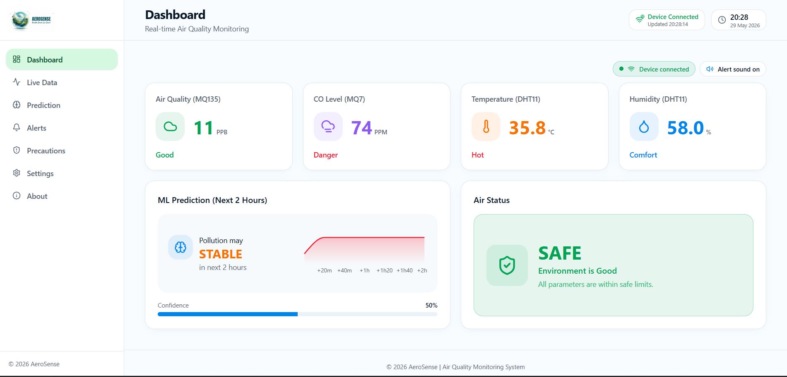
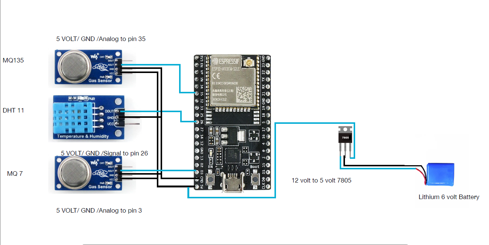
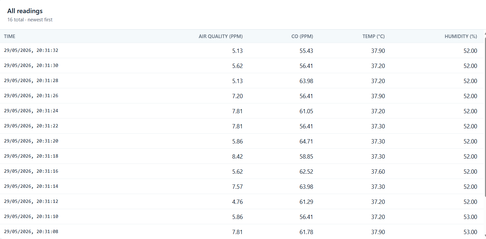
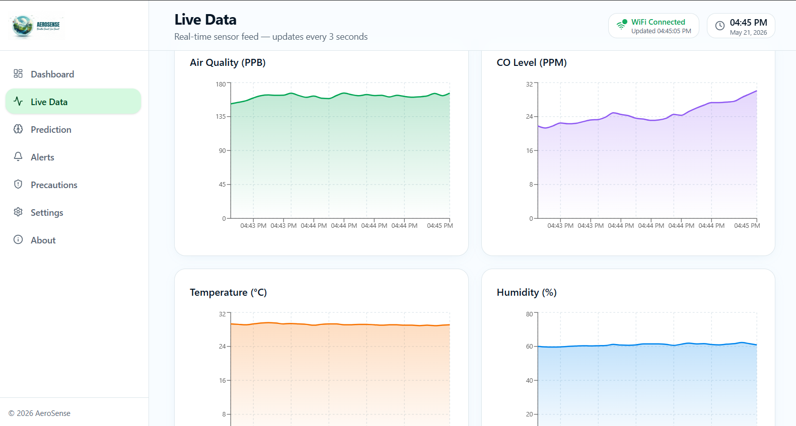
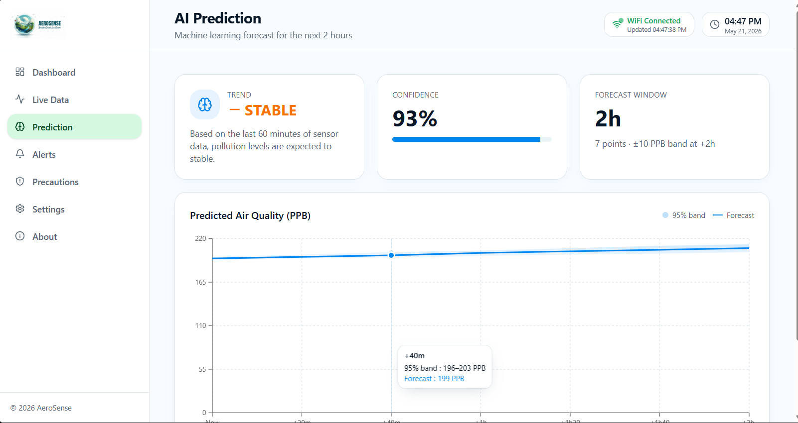
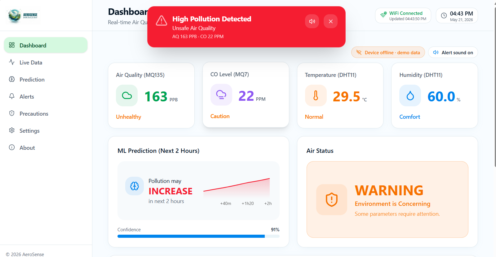
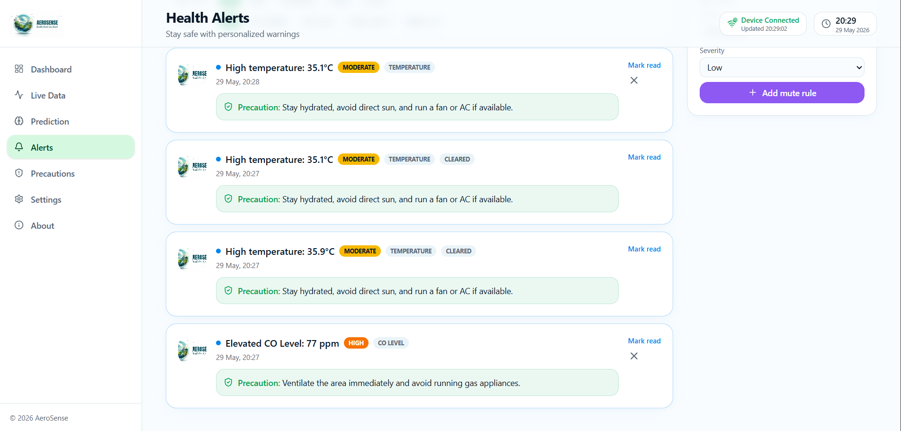
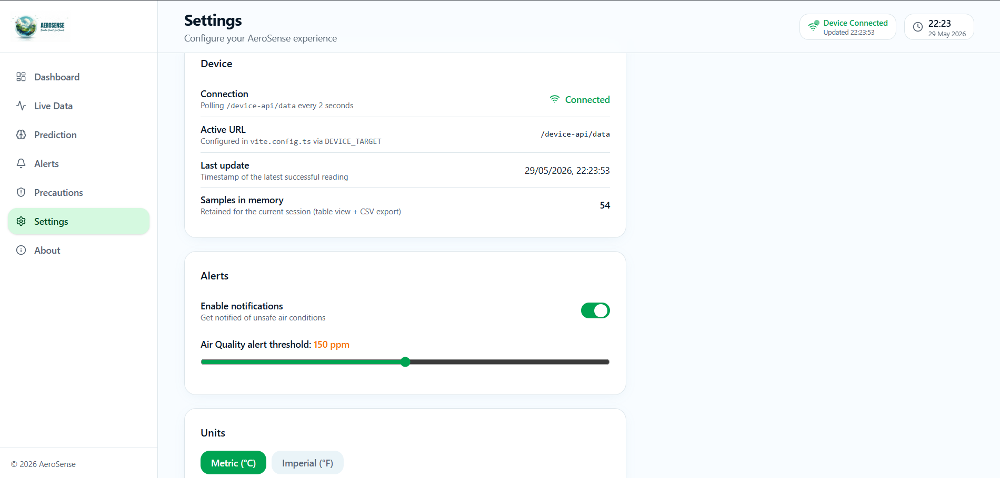

# 🌿 AeroSense
### Smart Air Quality Monitoring and Prediction System for Asthma & Allergy Patients

<p align="center">
  
</p>

<p align="center">
An AI & IoT based smart healthcare solution that monitors environmental air quality in real time, predicts pollution trends, and provides alerts to help asthma and allergy patients stay safe.
</p>

---

# 📌 Table of Contents

- [Overview](#-overview)
- [Problem Statement](#-problem-statement)
- [Objectives](#-objectives)
- [Key Features](#-key-features)
- [Technology Stack](#-technology-stack)
- [Hardware Components](#-hardware-components)
- [System Workflow](#-system-workflow)
- [Project Screenshots](#-project-screenshots)
- [Project Structure](#-project-structure)
- [Installation & Setup](#-installation--setup)
- [Future Enhancements](#-future-enhancements)
- [Developer](#-developer)

---

# 📖 Overview

AeroSense is an AI and IoT-based smart air quality monitoring system designed to assist asthma and allergy patients in monitoring environmental conditions. The system collects live sensor data using an ESP32 microcontroller, displays the readings through an interactive web dashboard, predicts air quality trends, and alerts users whenever pollution reaches unsafe levels.

The goal of AeroSense is to provide an affordable, portable, and intelligent solution that helps users make informed health decisions based on real-time air quality.

---

# ❗ Problem Statement

Air pollution has become one of the major causes of respiratory diseases worldwide. Individuals suffering from asthma and allergies are highly vulnerable to harmful gases and poor air quality. Existing air quality monitoring systems are often expensive, location-specific, or do not provide personalized health alerts.

AeroSense addresses this challenge by offering a portable and intelligent air quality monitoring system capable of real-time monitoring, prediction, and health notifications.

---

# 🎯 Objectives

- Monitor environmental air quality in real time.
- Collect live sensor readings continuously.
- Predict future air quality using AI techniques.
- Alert users when pollution exceeds safe thresholds.
- Provide health precautions for asthma and allergy patients.
- Develop a responsive web dashboard for easy monitoring.

---

# ✨ Key Features

✅ Real-Time Air Quality Monitoring

✅ Live Sensor Data Collection

✅ Interactive Dashboard

✅ AI-Based Air Quality Prediction

✅ Pollution Alerts

✅ Browser Notifications

✅ Health Precautions

✅ Responsive Web Interface

✅ Device Settings Management

---

# 💻 Technology Stack

## Frontend

- React
- TypeScript
- TanStack Start
- Vite
- Tailwind CSS

## Hardware

- ESP32
- MQ135 Air Quality Sensor
- MQ7 Carbon Monoxide Sensor
- DHT11 Temperature & Humidity Sensor
- TP4056 Charging Module
- MT3608 Boost Converter
- 18650 Rechargeable Battery

## Development Tools

- VS Code
- Git
- GitHub
- Vercel

---

# 🔌 Hardware Components

| Component | Purpose |
|-----------|---------|
| ESP32 | Microcontroller |
| MQ135 | Air Quality Sensor |
| MQ7 | Carbon Monoxide Sensor |
| DHT11 | Temperature & Humidity |
| TP4056 | Battery Charging Module |
| MT3608 | Voltage Boost Converter |
| 18650 Battery | Portable Power Supply |

---

# ⚙️ System Workflow

```
Air Quality Sensors
        │
        ▼
      ESP32
        │
        ▼
 Live Sensor Data
        │
        ▼
 Web Dashboard
        │
 ┌──────┴────────┐
 ▼               ▼
Prediction     Alerts
        │
        ▼
 Health Precautions
```

---

# 📷 Project Screenshots

## 🏠 Dashboard



---

## 🔌 Hardware Connection



---

## 📡 Live Data Collection



---

## 📈 Live Monitoring



---

## 🤖 Air Quality Prediction



---

## 🚨 Alerts



---

## 🔔 Notification



---

## ⚙️ Settings



---

# 📂 Project Structure

```
AeroSense
│
├── screenshots/
│   ├── logo.png
│   ├── dashboard.png
│   ├── hardware-connection.png
│   ├── live-data-collection.png
│   ├── live-monitoring.png
│   ├── prediction.png
│   ├── alerts.png
│   ├── notification.png
│   └── settings.png
│
├── src/
│   ├── assets/
│   ├── components/
│   ├── hooks/
│   ├── lib/
│   ├── routes/
│   ├── router.tsx
│   ├── server.ts
│   ├── start.ts
│   └── styles.css
│
├── package.json
├── vite.config.ts
└── README.md
```

---

# 🚀 Installation & Setup

### Clone Repository

```bash
git clone https://github.com/Shashikala-05/AeroSense.git
```

### Navigate to Project

```bash
cd AeroSense
```

### Install Dependencies

```bash
npm install
```

### Start Development Server

```bash
npm run dev
```

### Build for Production

```bash
npm run build
```

---

# 🚀 Future Enhancements

- Mobile application support
- Cloud database integration
- SMS & Email notifications
- GPS-based pollution tracking
- Historical data analytics
- Wearable device integration
- Personalized health recommendations
- Advanced AI prediction models

---

# 👩‍💻 Developer

**Shashikala G**

**Master of Computer Applications (MCA)**

**Specialization:** Artifical Intelligence, Machine Learning & Data Science

---

# 📄 License

Copyright © 2026 Shashikala G.

This project was developed as part of the Master of Computer Applications (MCA) final-year project.

This repository is shared for educational and portfolio purposes only. No part of this project may be copied, modified, or redistributed without prior written permission from the author.

---

# ⭐ Support

If you found this project useful, please consider giving it a ⭐ on GitHub.
